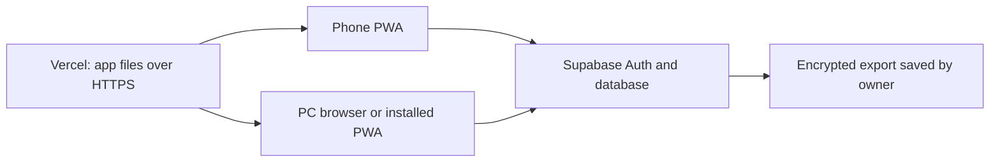

# Personal Money Management PWA — design for review

Status: application code and database migration built locally for review. No Supabase project, owner account, real financial data, or Vercel deployment has been created. Live-device verification remains before production use.  
Date: 5 October 2026

## 1. Purpose and scope

This is a private, single-owner app for use on a PC and phone. It should answer:

1. How much money do I have, and where is it?
2. How much is reserved for each goal, and in which accounts or investments?
3. What did I plan for this month, and what actually happened?
4. How have balances, spending, and goals changed over time?

Version 1 includes accounts, manually recorded income/expenses/transfers, investment balances, monthly plans and budgets, recurring items, savings goals, line graphs, dismissible in-app alerts, backups, and an installable PWA. Bank connections, live investment prices, shared access, multiple currencies, and financial advice are outside version 1.

Proposed default currency is INR. Store money as integer paise to avoid rounding errors. Use the Asia/Kolkata calendar for monthly plans, due dates, and charts; store event timestamps in UTC.

## 2. System architecture



| Part | Proposed choice | Responsibility |
| --- | --- | --- |
| Website/PWA | Next.js, TypeScript, responsive CSS | Screens, forms, calculations, charts, installable app shell |
| Hosting | Vercel Hobby | Serve the app at a free `vercel.app` address over HTTPS |
| Sign-in and data | Supabase Auth + PostgreSQL | One owner identity and the authoritative financial records |
| Client sync | Supabase API + Realtime change events | Save changes and refresh another open device |
| Offline storage | IndexedDB on each device | Last-synced read data and a queue of new transactions |
| Backups | Encrypted downloadable JSON plus CSV export | Owner-controlled recovery and portability |

The browser uses Supabase's publishable key to make signed-in requests. Database Row Level Security (RLS) enforces access. An administrator/service-role key must never be in the browser bundle or repository.

## 3. Navigation and screens

Desktop uses a left sidebar; mobile uses bottom navigation for Dashboard, Transactions, Plan, and More. The same data and rules power both layouts. Every screen shows `Synced`, `Syncing`, `Offline`, or `Needs attention`.

| Screen | Main contents and actions |
| --- | --- |
| Setup | Sign in with the owner account created during private setup; choose INR/time zone, add initial accounts and opening balances, optionally create a first plan and goal. |
| Dashboard | Total assets, debts, net worth, available cash, month-to-date income/spending, plan progress, goal cards, alerts, and line graphs. |
| Transactions | Search/filter ledger; add income, expense, transfer, card payment, investment contribution, or correction; edit with history. Mobile has a prominent Add button. |
| Accounts | Cash/bank/card/loan/investment balances and details; see account history and reserved versus available money. |
| Monthly Plan | Expected income, fixed bills, category budgets, savings/investment contributions; planned versus actual; create next month by copying or from scratch. |
| Recurring | Templates for rent, salary, subscriptions, SIPs, EMIs; due dates; mark complete or skip an occurrence. |
| Goals | Target, date, funded amount, forecast, line graph, and linked account/holding breakdown. |
| Reports | Net worth, cash, investments, spending, and goal progress over selected months. |
| Alerts | Active, snoozed, and dismissed notices; restore a dismissed notice. |
| Settings | Sign-in, categories, notification thresholds, data export/import, sync status, and account archiving. |

## 4. Money and accounting rules

Accounts show *where money is*. Goals show *what part of it is reserved*. A goal allocation never creates new money.

Example: Savings Account ₹1,00,000; Mutual Fund current value ₹15,000; credit card owed ₹5,000. Assets are ₹1,15,000 and net worth is ₹1,10,000. If ₹25,000 in savings and the ₹15,000 fund are assigned to Emergency Fund, the goal has ₹40,000 and unreserved savings cash is ₹75,000. The goal is not added again to assets.

| Event | Balance/report effect |
| --- | --- |
| Opening balance | Establishes the starting account amount as of a chosen date; not income. |
| Income | Increases an asset account and monthly income. |
| Expense from cash/bank | Decreases an asset account and counts toward the selected monthly expense category. |
| Credit-card purchase | Increases card debt and counts as an expense once, on the purchase date. |
| Transfer or card repayment | Moves value between accounts/reduces card debt; does not count as income or a new expense. |
| Investment contribution | Moves cash into an investment holding and increases cost basis and its provisional value until the next manual valuation; not an expense. |
| Investment valuation | Updates the holding's current market value; changes net worth, not income or spending. |
| Savings goal allocation | Reserves existing cash or a share of an investment; does not change account balances. |
| Loan EMI, if loans are tracked | Split the payment into principal (reduces debt) and interest/fees (expense). No automatic amortization in version 1. |

All balance-changing actions are recorded as a transaction with account entries. Account balances and reports derive from these records; the UI must not maintain an unrelated editable balance. Corrections retain an audit trail. Account reconciliation shows a discrepancy and asks for missing transactions or a named adjustment.

## 5. Monthly planning and budgets

The month screen begins with **Copy previous month and edit** or **Create from scratch**. Copying creates a draft containing planned amounts, categories, and due dates. It does not copy actual transactions, paid status, or old alert dismissals. The draft is reviewed before saving.

Each month has these plan lines:

| Line type | Example | Actual value comes from |
| --- | --- | --- |
| Expected income | Salary ₹X | Income transactions |
| Fixed expense | Rent ₹X due on the 5th | Matching rent expense transaction |
| Variable category budget | Food ₹X | Sum of food expenses in that month |
| Savings contribution | Emergency Fund ₹X | New allocation to the goal |
| Investment contribution | Mutual Fund SIP ₹X | Cash-to-investment transfer |

A single contribution may both move cash into an investment and fund a goal. It appears once in the monthly plan, with both a destination holding and an optional destination goal. The plan shows expected income, planned spending, planned saving/investment uses, and unassigned remainder; it flags a plan that uses more than expected income. Planned amounts are editable without changing past actual transactions.

Recurring items are templates, not automatic payments. At the start of a month, the app generates one expected occurrence per template and due date. A recurring template and a copied plan line with the same identity become one planned item, not duplicates. Marking an occurrence paid creates or links one actual transaction. Skipping an occurrence preserves its history. Changing a template affects future occurrences unless the owner explicitly changes a past month.

## 6. Savings goals and investments

Each goal has a name, target amount, optional target date, planned monthly contribution, notes, and status. The goal page shows `funded / target`, progress percentage, planned monthly saving, estimated completion, and every linked source, for example:

```text
Emergency Fund
₹40,000 of ₹3,00,000 (13%)
Planned monthly saving: ₹10,000
Estimated completion: calculated from the current funded value and plan
Linked sources:
  Savings Account: ₹25,000
  Mutual Fund: ₹15,000 at its latest recorded value
```

Cash allocation is a fixed rupee amount reserved in an account. The app prevents allocating the same available cash twice. If a later expense would use reserved cash, the app asks the owner to release/reassign the allocation first; an imported correction that creates a shortfall is flagged for review.

Investment allocation is a share of a holding (for example, all or 30% of a mutual fund). Its rupee value moves with the latest manually entered valuation. Shares allocated across goals cannot exceed 100%. This keeps goal values tied to actual investment value. The app shows both invested cost and latest market value, with a `last valued on` date so an old value is never presented as a live quote.

The completion estimate uses the currently funded value, target, and planned monthly contribution. It is a projection, not a guarantee. If the contribution is zero or the target is already met, the app shows an appropriate status instead of a date. Investment gains/losses may change the estimate.

## 7. Dismissible alerts

Version 1 alerts appear *inside the app* when it is opened. Background push notifications are a separate feature; in-app alerts should not imply the phone will notify while the app is closed.

| Alert | Actions | Dismissal scope |
| --- | --- | --- |
| Rent due in 3 days | Mark paid, snooze, dismiss | That rent occurrence; next month's reminder can appear |
| Food budget reached 85% | Open plan, dismiss | That category/threshold/month |
| Category over budget | Open plan, dismiss | That category/month |
| Goal/account allocation shortfall | Review allocation, dismiss | Reappears if a new shortfall occurs |
| Sync failed or backup overdue | Resolve or dismiss | Reappears if the condition recurs |

Dismissal and snooze choices are saved in Supabase so they apply on PC and phone. A dismissed-alert history lets the owner restore an alert. Alerts are generated from dates and current data, so no continuously running server job is needed for version 1.

## 8. Graphs and reporting

Dashboard line charts: total assets and net worth; cash versus investments; selected goal's funded value. Reports add cumulative spending versus monthly plan and month-by-month income/spending. Default range is 12 months, with shorter ranges available.

Historical values are calculated from dated transactions and recorded investment valuations. If a fund was first valued in March, the app does not invent prices for January or February. Backdated entries recalculate later points. Hover/tap reveals exact amount and date. The chart legend distinguishes assets, liabilities, net worth, and goal allocations so they are not added together.

## 9. Sync and offline behavior

Supabase is the authoritative record. On app open, on returning to the foreground, and after a successful write, the app refreshes relevant data. While both devices are open, Supabase Realtime triggers a refresh; the open/foreground refresh ensures updates are not missed if a live connection drops.

The installable PWA caches its app shell and an explicit local copy of the last-synced data. Version 1 supports viewing that copy and adding new transactions offline. Each offline transaction gets a client-generated ID and is queued in IndexedDB. Reconnect uploads it once, retries safely, and then refreshes balances and graphs. Offline balances are labeled provisional. If another device spent or reserved the same money meanwhile, the server may reject the queued item; it remains visible under `Needs attention` for the owner to resolve. The UI warns before signing out or clearing local data if items are unsynced.

For version 1, editing/deleting existing transactions, changing goal allocations, and editing monthly plans require a connection. This is a deliberate refinement of the earlier broad offline proposal: full offline editing needs substantially more conflict handling. Online edits use a record version so a phone edit cannot silently overwrite a newer PC edit; the app shows both versions for review if that happens. No transaction is marked `Synced` until the server confirms it.

Local browser storage can be cleared by the browser or user and is accessible to someone who can use an unlocked device/browser profile. The cloud copy and exported backups remain essential; pending offline changes are at risk until uploaded.

## 10. Security, backup, and recovery

Create exactly one Supabase owner account during private setup, verify its email, then disable new sign-ups. Enable RLS on every financial table, restrict access to that owner ID, and verify that anonymous/other-user requests cannot read or write records. Use HTTPS, a strong account password, and multifactor authentication if desired. Keep the source repository private. Browser code contains only the public Supabase URL and publishable key; no service-role key or database password.

The app provides an encrypted, passphrase-protected JSON export of all financial records and settings, plus an optional plain CSV export for spreadsheets. A restore flow previews totals and record counts before importing into an empty/new project; it must prevent duplicates. The app reminds the owner to export a backup monthly, and we test restoration against the development project. The owner should keep a copy outside the phone/PC used for daily entry.

Supabase Free currently does **not** include automatic database backups. Its documentation recommends regular manual exports/dumps. If a free project is paused after low activity, the owner resumes it in Supabase Studio; the app must show a clear connection error and keep any pending local transactions until it is available again. Source: [Supabase backups](https://supabase.com/docs/guides/platform/backups), [project pausing](https://supabase.com/docs/guides/platform/free-project-pausing).

## 11. Proposed data model

All owner data records carry an owner ID, stable UUID, creation/update timestamps, and (where editable) a version. Main entities:

| Entity | Main fields / purpose |
| --- | --- |
| `accounts` | Name, kind (cash/bank/card/loan/investment), opening date/value, active flag |
| `transactions` + `entries` | Dated event, amount, type, category, notes, account balance effects, correction history |
| `categories` | Income and expense categories, archived flag |
| `investment_valuations` | Holding, as-of date, manually entered market value |
| `monthly_plans` + `plan_items` | Month, source/copy metadata, expected income, fixed/variable/saving/investment lines |
| `recurring_templates` + `occurrences` | Frequency, due day, expected amount, status, linked actual transaction |
| `goals` + `goal_allocations` | Target/deadline/default contribution; fixed cash allocation or investment share |
| `alert_states` | Alert identity, month/occurrence, dismissed/snoozed state |

Database constraints enforce positive transaction amounts, valid account references, no duplicate recurring occurrence per template/month, and no duplicate offline transaction ID. Cross-record operations that must succeed together (for example, transfer and its two account entries) run atomically in the database.

## 12. Build and verification sequence after design approval

1. **Wireframes and examples:** finalize desktop/mobile layouts and sample accounts, categories, goals, and a sample month. Confirm the decisions below.
2. **Foundation:** create the codebase, PWA manifest/icons, local development setup, Supabase migrations, owner sign-in, and RLS rules. Prove anonymous and unintended-user access is denied.
3. **Money ledger:** account setup, opening balances, income, expenses, transfers, card payments, investment contribution/valuation, correction history, and account reconciliation. Verify balance arithmetic with examples.
4. **Monthly plan and recurring:** both month-creation options, planned-versus-actual matching, due occurrences, and no duplicate actual payments. Verify copying does not copy transactions.
5. **Goals and reports:** linked cash/investment allocations, no double counting, forecasts, and historical line graphs. Verify investment valuation changes net worth and goal value without creating income.
6. **Alerts and PWA sync:** dismissal/snooze persistence, installation, offline new-transaction queue, retry/idempotency, conflict display, and sync status. Test on a PC and a real phone.
7. **Backup and deployment:** export/import recovery test, production security check, private repository, Vercel deployment, Supabase production project, and end-to-end PC/phone test. Deployment happens only after the owner reviews the built app.

Acceptance examples: a transfer does not alter net worth; a card payment is not counted twice as spending; a goal allocation does not raise assets; copy-month carries only plans; dismissed rent returns next month; an offline expense appears once after reconnect; another signed-in device shows the updated balance; backup restore reproduces totals.

## 13. Free deployment plan and limits

Use a private GitHub repository, Vercel Hobby, and Supabase Free. Vercel builds on code pushes and provides HTTPS and a `vercel.app` URL. Supabase holds the private records and sign-in. Use separate development and production Supabase projects if both fit the current free-project allowance; production data must never be used in preview builds. Schema changes are versioned as migrations and applied to development before production.

As checked on 5 October 2026, Vercel Hobby is free for personal, noncommercial use. Supabase Free includes a 500 MB database, but can pause for low activity and has no automatic backups. These terms can change, so recheck immediately before deployment. A custom domain is optional and would usually cost money. Sources: [Vercel Hobby](https://vercel.com/docs/plans/hobby), [Supabase pricing](https://supabase.com/pricing), [Supabase pausing](https://supabase.com/docs/guides/platform/free-project-pausing).

## 14. Decisions to confirm during review

The plan uses these defaults unless you change them:

1. INR only in version 1; dates and monthly boundaries use Asia/Kolkata.
2. Investment prices/current values are entered manually; no broker or bank connection.
3. Alerts are in-app; no background phone push in version 1.
4. Offline mode allows viewing saved data and adding new transactions; editing existing records requires internet.
5. Track credit cards and optional loans as debts, so dashboard can show both assets and net worth.
6. Backups are encrypted manual exports with a monthly reminder; automatic hosted backups are unavailable on Supabase Free.

Review these decisions and the accounting examples before implementation. The database schema and wireframes can be refined from your comments without creating or deploying the application yet.


## 15. New Additions and requirements
1. Add a Quick Save button which distributes a chosen amount equally among active goals; saving can exceed a goal's target. When a goal is completed, ask for the payment account(s), amount(s), and method(s). For spending beyond the completed goal's own allocation, ask on that occasion exactly how much to take from unreserved money and from named other goals. There is no automatic priority.
2. above rule also applies to transfers (suppose I move rs 10,000 from saving to mutual fund then all the goals which have saving will also be moved to mutual fund).

### Agreed behavior for these additions

- **Quick Save:** choose a source account and amount; split that amount equally among all active goals. A goal may exceed its target. Any indivisible remainder in paise is assigned deterministically so the allocations add up to the exact amount. The action reserves existing money and does not create income or increase total assets.
- **Transfer with goals:** move the transferred amount's reserved and unreserved portions in the same proportions as they existed in the source account immediately before the transfer. For example, if 40% of Savings is reserved for Goal A and 20% for Goal B, a ₹10,000 transfer carries ₹4,000 for A, ₹2,000 for B, and ₹4,000 unreserved into the destination. When the destination is an investment, goal-linked amounts become shares of the holding based on its recorded value. Total goal value and total assets do not jump merely because of the transfer.
- **Complete a goal:** open a confirmation dialog asking for spending amount, payment method, and one or more source accounts with amounts. Show exactly how much of the completed goal's allocation will be released from each source. If spending exceeds that allocation, ask *each time* whether to use unreserved money or reduce specific other goals, and by how much. Do not choose this order automatically. Save the expense(s), allocation changes, and completed status together. Preserve the goal and spending history.

## 16. Implementation and review notes

The application and SQL migration now live in this repository. [SETUP.md](SETUP.md) is the step-by-step path from an empty Supabase project to a private Vercel deployment. The SQL finance rules have passed local PostgreSQL smoke tests, and the web app passes a production build; the owner sign-in, cloud RLS, backup/restore, phone installation, and two-device sync still require a real Supabase/Vercel setup and the acceptance checks in that guide. No production financial data should be entered before those checks.

This first build intentionally has no live bank/broker integration, background push alerts, or automated investment prices. In-app due and budget alerts use the fixed 85% warning threshold. Investment holdings show recorded market value and valuation date, but tax cost basis and account reconciliation are not yet dedicated workflows. Routine transactions can be corrected through an auditable reversal; transfers that moved goal allocations, goal-completion payments, and some linked records require a reviewed manual correction rather than a one-click edit. A past-dated transfer into accounts with goal-allocation or valuation history is rejected to avoid inventing incorrect proportional history.
